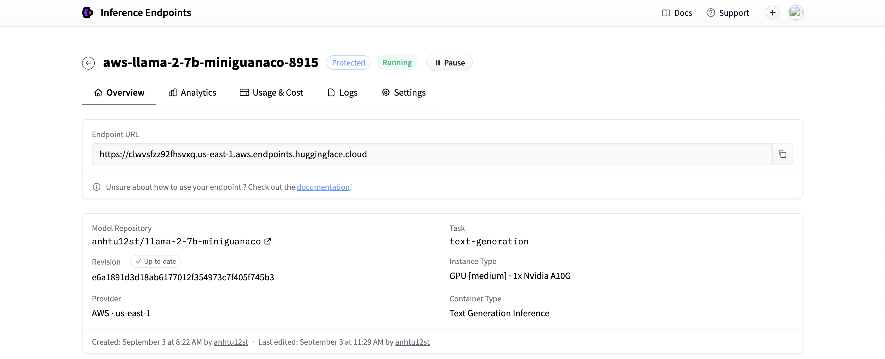

# Expert Identification in Research Domains

The primary aim of this project is to develop an AI-powered solution designed to facilitate the accurate identification of experts within specific research domains. This initiative recognizes the crucial role of assembling a group of experts in ensuring the success of both industrial and research projects.


## Table of Contents

- [Introduction](#introduction)
- [Getting Started](#getting-started)
  - [Prerequisites](#prerequisites)
  - [Installation](#installation)
- [Usage](#usage)
  - [Data Folder](#data-folder)
  - [Frontend Folder](#frontend-folder)
  - [Train model Folder](#Train-model-folder)
  - [Host on Hugging Face](#host-on-hugging-face)
- [Contributing](#contributing)
- [License](#license)
- [Acknowledgments](#acknowledgments)

## Introduction

Expert Identification: The core objective of this project is to create a platform that allows users to pinpoint experts within a particular research field. Traditionally, databases like Google Scholar and Semantic Scholar enable users to search for research papers, but our solution will go a step further by helping users identify a cohesive group of experts in their chosen domain.

## Getting Started

Explain how to get started with your project. Include instructions on how to set up the environment, install dependencies, and run the project.

### Prerequisites

List any prerequisites or system requirements that users need to meet before using your project. Include software, libraries, or hardware.

### Installation

Install all require packages using conda:

```
conda create -n deltacognition python=3.10
conda activate deltacognition
pip install -r requirements.txt
```

## Usage

Explain how to use your project. Break this section into subsections if you have different components or tasks.

### Data Folder

The "data" folder in this project serves the crucial purpose of crawling data from PaperWithCode, a valuable resource for academic documents and research papers. This folder contains various scripts and utilities to facilitate the data crawling process and transform the collected data into a usable format for fine-tuning models.

#### Files in the "data" Folder

1. **request-crawler.py**

   - Purpose: This Python script uses the `requests` package to crawl data from PaperWithCode.
   - Requirements: To use this script, you need to add an authentication token to your requests to access the data.
   
2. **selenium-crawler.py**

   - Purpose: Unlike the `request-crawler.py`, this script utilizes Selenium to crawl data from PaperWithCode. It's an alternative approach that can be useful when the website's UI structure poses limitations.
   - Note: This method interacts with the website's UI, so it might be more prone to changes in the website's layout.

3. **transform.py**

   - Purpose: Once data is crawled, it often needs to be transformed into a more structured and usable format. This script serves that purpose by transforming raw crawled data into a format that can be readily used for fine-tuning models.
   - Example Transformation:
     ```json
     {
         "id": "/paper/nougat-neural-optical-understanding-for",
         "title": "nougat: neural optical understanding for academic documents",
         "date": "25 aug 2023",
         "authors": [
             "lukas blecher",
             "guillem cucurull",
             "thomas scialom",
             "robert stojnic"
         ],
         "categories": [
             "optical character recognition (ocr)"
         ]
     }
     ```
     Transforms to:
     ```
     "The paper \"nougat: neural optical understanding for academic documents\" with technology optical character recognition (ocr) is created by lukas blecher, guillem cucurull, thomas scialom, robert stojnic"
     ```

4. **utils.py**

   - Purpose: This utility script contains functions and methods that are essential for retrieving specific data from the crawled content. It helps in extracting information such as paper titles, authors, publication dates, and categories.

These scripts and utilities collectively enable the extraction, transformation, and preparation of data from PaperWithCode for further use, such as fine-tuning machine learning models or conducting research analysis.


### Frontend Folder

The "frontend" folder in this project is responsible for creating the user interface (UI) using React, Yarn, and TypeScript. This UI enables users to search for experts and displays the results in a user-friendly table format.

#### Technologies Used

- **React**: A JavaScript library for building user interfaces, known for its reusability and component-based architecture.

- **Yarn**: A package manager that simplifies dependency management and package installation.

- **TypeScript**: A statically typed superset of JavaScript, which enhances code quality and development tooling.

#### Features

The frontend UI offers the following features:

1. **Search Input**: Users can input their search queries related to research interests.

2. **Expert List Table**: Search results are presented in a table format, displaying expert information including names, research focuses, recent publications, and affiliations.

#### Getting Started

To run the frontend and develop on localhost:3000
```
cd ./frontend
yarn
yarn start
```


### Train model Folder

The code performs the following main tasks:

1. Fine-tuning a pre-trained LLaMA2-7B model from the Hugging Face model hub.
2. Configuring QLoRA parameters and BitsAndBytes quantization settings for efficient model training.
3. Setting up TrainingArguments for training the model, including gradient accumulation, optimizer choice, learning rate schedule, etc.
4. Performing supervised fine-tuning on a custom dataset.
5. Saving the trained model and tokenizer for future use.
6. Running a text generation pipeline using the fine-tuned model to recommend a list of scientists based on a given prompt.

### Host on Hugging Face

```
model.push_to_hub(new_model, use_temp_dir=False)
tokenizer.push_to_hub(new_model, use_temp_dir=False)
```



## License

This code is open-source and freely available under the [MIT License](LICENSE).

**MIT License**

